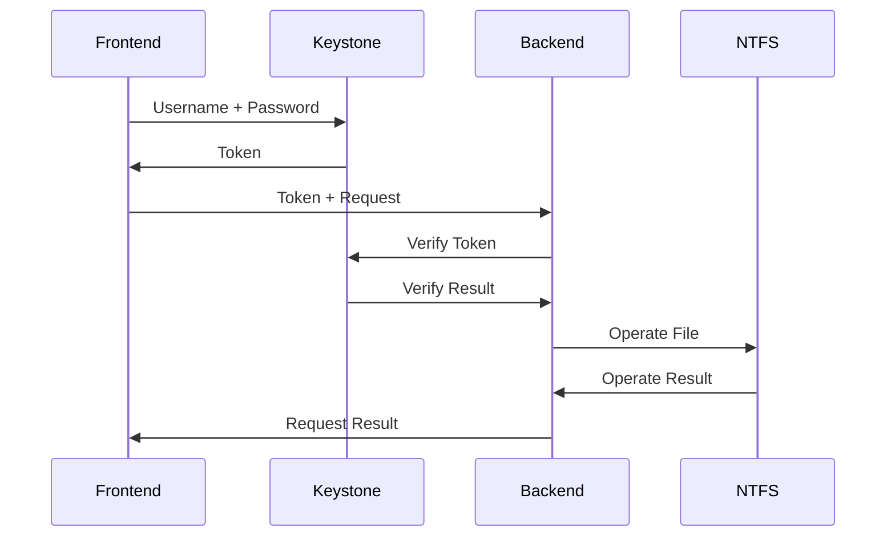
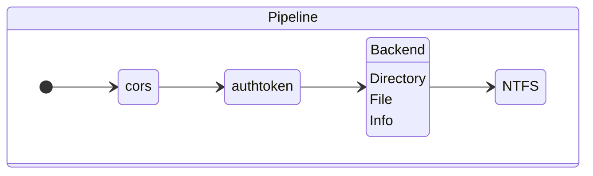
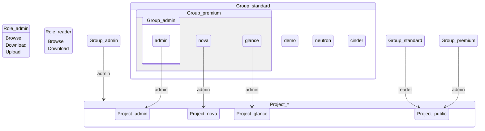

# sibyl-backend

## Workflow Overview



## Backend Pipeline Overview



## Keystone RBAC Overview



## Project setup

1. Connect to the database server

```
sudo mysql
```

2. Create the sibyl database

```
CREATE DATABASE sibyl;
USE sibyl;
CREATE TABLE user (name VARCHAR(255), info VARCHAR(255));
```

3. Configure RBAC rules

```
./init_keystone.sh
```

## Project deploy

```
python myService.py
```
